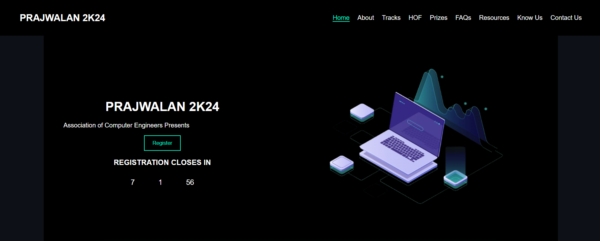

# PRAJWALAN 2K24 - Event Website

## Overview
PRAJWALAN 2K24 is an official event website designed to provide information about the annual technical fest. This website showcases event details and contact information. Built using HTML, CSS, and JavaScript, the site offers a user-friendly experience for participants and visitors.

## Technologies Used
- **HTML**: Structure of the website.
- **CSS**: Styling and layout.
- **JavaScript**: Interactive elements and form validation.

## Installation & Deployment
### Local Setup
1. Clone the repository:
   ```bash
   git clone https://github.com/YOUR_GITHUB_USERNAME/prajwalan-2k24.git
   ```
2. Navigate to the project folder:
   ```bash
   cd prajwalan-2k24
   ```
3. Open `index.html` in a browser to view the website.


## Contact
For queries, feel free to reach out:
- **Email**: mounika212325@gmail.com
---
**PRAJWALAN 2K24** - Ignite the Future!
## Event Banner


